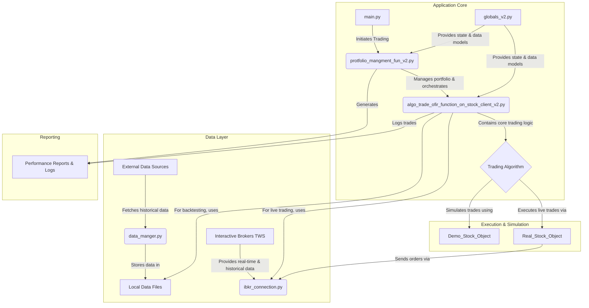

# Algorithmic Trading Bot for Interactive Brokers

## Overview

This project is a sophisticated, multi-threaded algorithmic trading bot designed to trade stocks on the Interactive Brokers (IBKR) platform. It supports both backtesting against historical data and live/paper trading. The core strategy is a momentum-based approach that dynamically allocates capital across a portfolio of stocks, aiming to maximize returns by concentrating on high-performing assets.

## Features

*   **Multi-Stock Trading**: Concurrently trades a configurable list of stocks.
*   **Dynamic Portfolio Management**: Automatically reallocates capital based on real-time performance analysis.
*   **Backtesting Engine**: Test strategies against historical data before deploying them live.
*   **Live/Paper Trading**: Connects directly to Interactive Brokers' Trader Workstation (TWS) for real-world trading.
*   **Robust Concurrency**: Heavily multi-threaded to handle asynchronous market data and trade execution efficiently.
*   **Detailed Reporting**: Generates logs, performance summaries, and plots for each trading session.

## Architecture

The application is built with a modular architecture that separates concerns, from data handling to trading logic and execution.



## Core Components

*   `main.py`: The main entry point of the application. Configures the initial parameters like the stock list and starting capital.
*   `protfolio_mangment_fun_v2.py`: The central orchestrator. It manages the trading session, initializes the portfolio, and generates final reports.
*   `algo_trade_ofir_function_on_stock_client_v2.py`: Contains the core trading logic and the portfolio rebalancing strategy (`divide_available_money`).
*   `ibkr_connection.py`: A wrapper for the Interactive Brokers API. It handles all communication with TWS, including data fetching and order execution.
*   `globals_v2.py`: A centralized module for all global state, configuration variables, and the primary data models (`Demo_Stock_Object`, `Real_Stock_Object`).
*   `data_manger.py`: A utility script to download historical market data from Alpha Vantage for backtesting purposes.

## Setup and Usage

### Prerequisites

*   Python 3.x
*   Interactive Brokers Trader Workstation (TWS) or IB Gateway installed and running.
*   Required Python packages (e.g., `ibapi`, `numpy`, `pandas`, `matplotlib`, `requests`). You can install them via `pip`.

### Configuration

1.  **Connection**: In `ibkr_connection.py`, configure the `TRADING_PORT` to match your TWS setup (e.g., `7497` for paper trading, `4001` for live).
2.  **Stocks**: In `main.py`, modify the `stocks_check` list to include the stock symbols you want to trade.
3.  **Capital**: In `main.py`, set the `my_available_money_dollar_start` variable to your desired starting capital.
4.  **Mode**:
    *   **Backtesting**: Set `glb.dbg_local = True` in `main.py`. Ensure you have downloaded the necessary historical data using `data_manger.py`.
    *   **Live/Paper Trading**: Set `glb.dbg_local = False` in `main.py`.

### Running the Bot

Execute the main script from your terminal:

```bash
python main.py
```

The bot will start, connect to TWS (if in live mode), and begin executing its trading strategy. Logs and performance reports will be saved in the `paper_trading_data_result` directory.

## Trading Strategy

The core strategy is a momentum-based algorithm that operates on intraday (1-minute) data.

1.  **Simulation**: The bot runs a continuous simulation for each stock in the portfolio using the `Demo_Stock_Object`. This allows it to evaluate the strategy's performance in near real-time.
2.  **Performance Ranking**: Periodically, the `divide_available_money` function ranks all stocks based on a custom metric that combines profitability and trading volume.
3.  **Capital Allocation**: The function then reallocates capital, shifting funds from underperforming stocks to the top-performing ones.
4.  **Execution**: The `Real_Stock_Object` for each stock in the live portfolio executes the buy/sell orders generated by the algorithm through the Interactive Brokers API.

This creates a dynamic system that adapts to changing market conditions by focusing capital on the most promising assets.