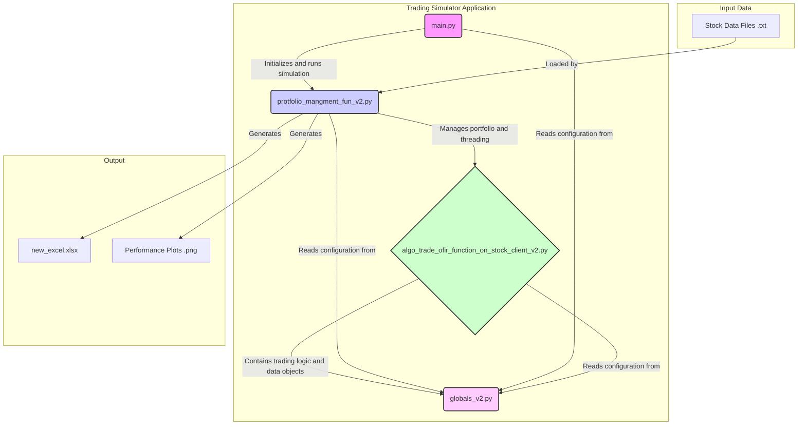

# Trading Simulator

This project is a backtesting engine for an algorithmic trading strategy. It's designed to simulate trading on historical stock data to evaluate the performance of a specific strategy.

## System Architecture

The following diagram illustrates the architecture of the trading simulator, showing the relationships between the different Python scripts, the data they consume, and the output they produce.

## Internal Architecture and File Descriptions

### `main.py`
*   **Role:** The main entry point of the application.
*   **Functionality:**
    *   Sets up the simulation parameters, including the list of stocks to test, the date range for the backtest, and the core strategy parameters (`limit_presantage`, `diff_p`).
    *   Initiates the simulation by calling the `trade_and_update_portfolio_local_data` function from `protfolio_mangment_fun_v2.py`.
    *   Contains commented-out code for running statistical analysis and parameter optimization, suggesting its use for testing and refining the trading strategy under different conditions.

### `protfolio_mangment_fun_v2.py`
*   **Role:** The central orchestrator of the backtesting simulation.
*   **Functionality:**
    *   Loads historical price data for the specified stocks from local `.txt` files.
    *   The `trade_and_update_portfolio_local_data` function iterates through each day in the specified date range.
    *   For each day, it uses the `threading` module to spawn a separate thread for each stock. This allows the simulation for all stocks to run concurrently for that day, significantly speeding up the backtest.
    *   It waits for all threads for a given day to complete before proceeding to the next day, ensuring chronological consistency.
    *   After the simulation is complete, it handles the aggregation of results and generates the final outputs: the detailed `new_excel.xlsx` log file and performance graphs using `matplotlib`.

### `algo_trade_of_ir_function_on_stock_client_v2.py`
*   **Role:** The heart of the system, containing the core trading algorithm and data structures.
*   **Functionality:**
    *   Defines the primary classes: `Demo_Stock_Object` and `Real_Stock_Object`.
        *   `Demo_Stock_Object`: Simulates the trading strategy for a single stock to identify potential buy/sell signals without affecting the main portfolio.
        *   `Real_Stock_Object`: Represents the actual portfolio. It executes trades based on signals from the `Demo_Stock_Object`, manages the portfolio's cash, and tracks the overall value.
    *   The `simulate_trading_local_data` method contains the minute-by-minute simulation loop where the trading logic is applied.
    *   The `Safe_Limit_condition_stock_trade_5` function implements the specific trading strategy, which appears to be a trailing take-profit/stop-loss mechanism based on percentage changes from a moving price target.

### `globals_v2.py`
*   **Role:** A centralized module for global state and configuration management.
*   **Functionality:**
    *   Holds all shared variables and configuration parameters, such as starting capital, commission fees, and file paths.
    *   Stores strategy-specific parameters that can be tuned from `main.py`.
    *   Maintains global data structures that are shared across threads, such as dictionaries for stock data, portfolio objects, and trade logs.

### Output Files
*   **`new_excel.xlsx`:** The primary output of the simulation. It's an Excel workbook containing a separate sheet for each traded stock. Each sheet provides a detailed, timestamped log of every transaction, including the action (buy/sell), price, volume, commission, and the resulting cash and portfolio value.
*   **Performance Plots (`.png`):** The system also generates plots to visualize the performance of the trading strategy, such as profit/loss curves over time.